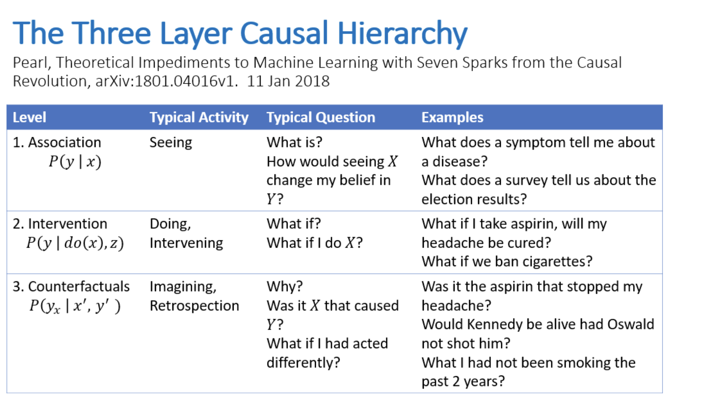
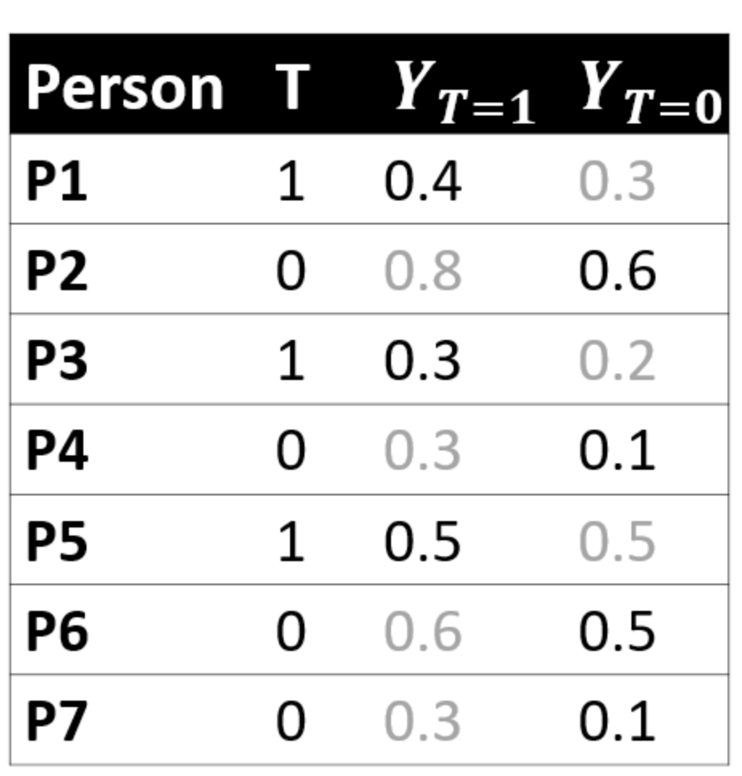
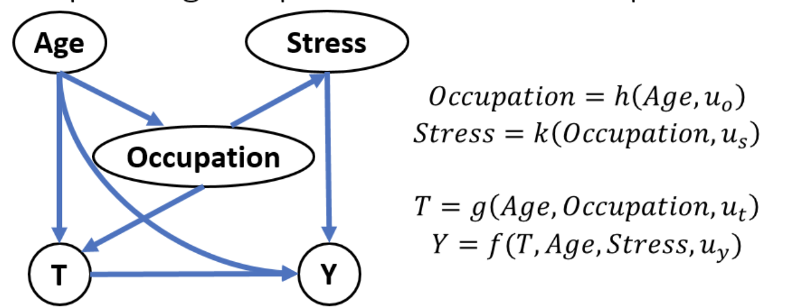
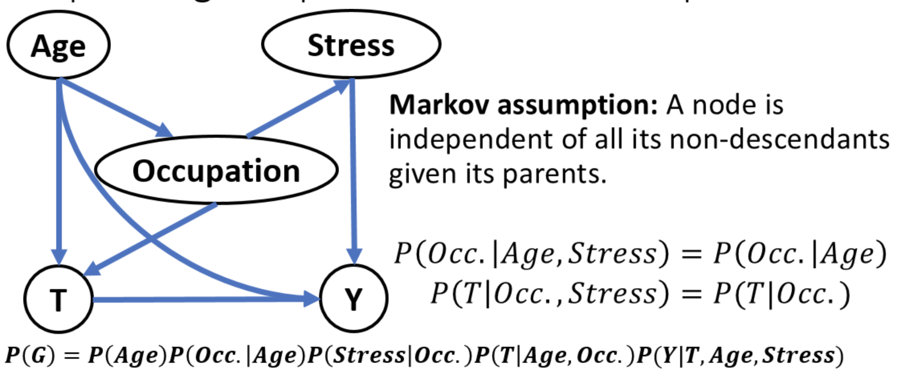
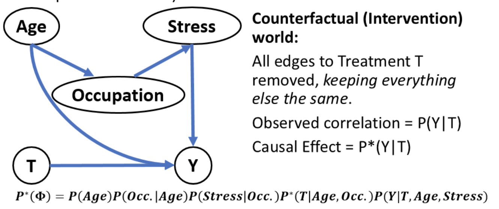
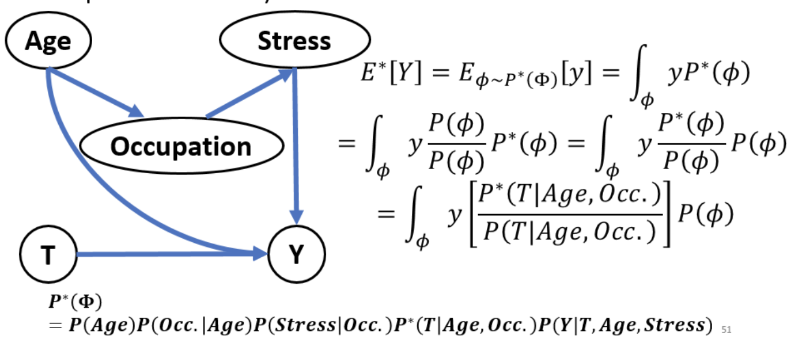
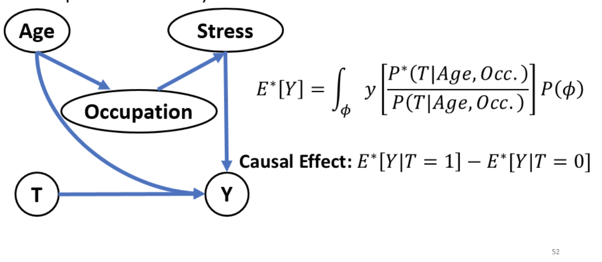
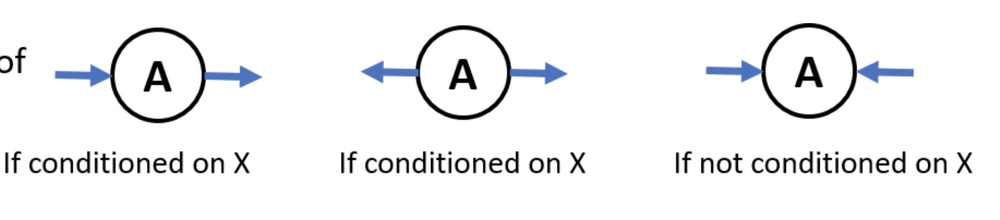
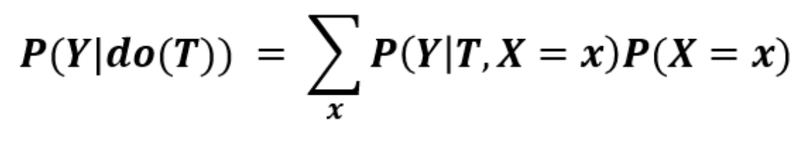
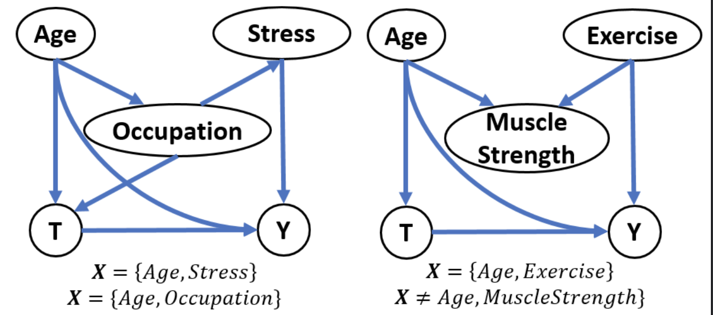

# Introduction to counterfactual reasoning

## Table of contents

- [Introduction to counterfactual reasoning](#introduction-to-counterfactual-reasoning)
  - [Table of contents](#table-of-contents)
  - [Intro](#intro)
  - [What is causality?](#what-is-causality)
  - [Potential outcomes framework](#potential-outcomes-framework)
    - [Recap](#recap)
  - [Unobserved confounds / Simpson's Paradox](#unobserved-confounds--simpsons-paradox)
  - [Structural causal model framework](#structural-causal-model-framework)
    - [Recap](#recap-1)
  - [Conclusion](#conclusion)

## Intro

**Do prediction models guide decision-making?**

Suppose we made a model that predicts a user's future activity based on their social feed exposure.
It turns out great.
Now from this, would changing the user's feed affect the user's activity?

Maybe, maybe not.
There could be a common factor affecting both! Correlation vs causation.

**Will the predictions be robust tomorrow or in new contexts?**

**What if prediction accuracy is high?**

You train and test from the same distribution.
This does not hold for real life.
Acting on the prediction changes the distribution.

_Prediction is insufficient for choosing interventions._

- **How often do they lead us to the right decision?**
  - Predictive insights provide no insights on effective decisions
- **Will the predictions be robust tomorrow?**
  - Correlation may change
  - Causal mechanics are more robust
- **What if prediction accuracy is hight?**
  - Active interventions change correlation

## What is causality?



**Practical definition of causality:** `T` causes `Y` iff changing `T` leads to a change in `Y`, keeping everything else constant.

**Causal effect** is the magnitude by which `Y` is changed by a unit change in `T`.

Imagine a _counterfactual_ world.
Reason about a world that does not exist.

- What is a system intervention was not done?
- What if an algorithm was changed?
- What if I gave a drug to a patient

## Potential outcomes framework

Causal inference is the problem of estimating the counterfactual.



Causal effect

```txt
E[Y1 - Y0]
```

Fundamental problem is that for any one person, you only get `Y1` or `Y0`.
Need some way to estimate `Y0`.

Randomized experiments are the gold standard, but can sometimes not be possible.

### Recap

- Potential outcomes reasons about causal effects by comparing outcome of treatment to outcome of no-treatment.
- For any individual, we cannot observe both treatment and no-treatment
- Randomized experiments are one solution

## Unobserved confounds / Simpson's Paradox

Suppose we switch from algorithm `A` to `B`.
Is it better?

New algorithm increases overall success rate.

What is there are unobserved features of the audience that matter?

**Simpson's Paradox**: New algorithm can bet better overall, but worse for each subgroup

| user type     | `A`               | `B`                 |
| ------------- | ----------------- | ------------------- |
| Low-activity  | 10/400 (2.5%)     | 4/200 (2%)          |
| High-activity | 40/600 (6.6%)     | 50/800 (6.2%)       |
| **Total**     | **50/1,000 (5%)** | **54/1,000 (5.4%)** |

_So which is better?_

## Structural causal model framework

**Structural causal model**
is a framework for expressing complex causal relationships

Edges represent _direct_ causes.
Directed paths represent _indirect_ causes.











Assumptions are edges that are _missing_

1. Assume `Occupation` does not affect `Y`
2. Assume `Age` does not affect `Stress`

etc...

Potential outcome and structural causal models are the same.

**Potential outcomes:** `E[Y1] - E[Y0]`
**Structural causal model:** `E*[Y | T = 1] - E*[Y | T = 0]`

If `E*[Y | T] -> E[YT]` then they are equal.

Structural causal models provides a language for expressing counterfactuals.

**If a person was given a treatment, what is the probability they would be cured if they were not given the treatment?**

`P(Y = 1 | T = 1, T = 0)` does not make sense, instead

```txt
P(Y0 = 1 | T = 1)
or
P(Y = 1 | T = 1, do(T = 0))
```

`P(Y | do(T))` is to avoid confusion with `P(Y | T)`

Other benefit is that it provides a mechanistic way of identifying causal effect.

**do-calculus** is a rule based calculus that can help identify counterfactual quantity.

Three types of node-edges:



A backdoor path is any undirected path that starts on `->T` and ends on `->Y`.

**Backdoor criterion:** If conditioning on `X` blocks all back-door paths, then:





Both frameworks have pros:

Structural causal model and do-calculus are for:

- Modeling the problem
- Making assumptions explicit
- Identifying the causal effect

Potential outcomes-based methods for:

- Estimating the causal effect

### Recap

- Allow us to make casual assumptions explicit (assumptions are the missing edges)
- Provide a language for expressing counterfactuals
- Well-defined mechanisms for reasoning about causal relationships (backdoor criterion)

## Conclusion

- **Causality** is important for decision-making and study of effects

- **Potential outcomes framework** gives practical method for estimating causal effects. Translated causal inference into counterfactual estimation.

- **Unobserved confounds** are a critical challenge

- **Structural causal model framework** gives language for expressing reasoning about causal relationships
