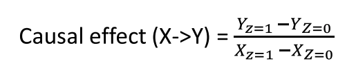
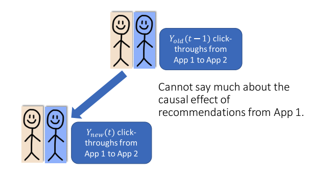

# 2 Methods for Causal Inference

## Table of contents

- [2 Methods for Causal Inference](#2-methods-for-causal-inference)
  - [Table of contents](#table-of-contents)
  - [Review](#review)
  - [Observational studies](#observational-studies)
    - [Conditioning on key variables](#conditioning-on-key-variables)
      - [Example](#example)
      - [Assumptions](#assumptions)
        - [Ignorability](#ignorability)
        - [Stable unit treatment value](#stable-unit-treatment-value)
        - [Common support](#common-support)
      - [Simple conditioning – summary](#simple-conditioning--summary)
        - [Definition](#definition)
        - [Intuition](#intuition)
        - [Example](#example-1)
        - [Keep in mind](#keep-in-mind)
    - [Matching and stratification](#matching-and-stratification)
      - [Propensity score](#propensity-score)
      - [Matching — Summary](#matching--summary)
        - [Definition](#definition-1)
        - [Intuition](#intuition-1)
        - [Example](#example-2)
        - [Keep in mind](#keep-in-mind-1)
      - [Stratification](#stratification)
      - [Stratification — summary](#stratification--summary)
        - [Definition](#definition-2)
        - [Intuition](#intuition-2)
        - [Example](#example-3)
        - [Keep in mind](#keep-in-mind-2)
    - [Weighting](#weighting)
        - [Weighting – summary](#weighting--summary)
          - [Definition](#definition-3)
        - [Intuition](#intuition-3)
        - [Keep in mind](#keep-in-mind-3)
    - [Simple regression](#simple-regression)
      - [Warnings](#warnings)
      - [Regression – Summary](#regression--summary)
        - [Definition](#definition-4)
        - [Example](#example-4)
        - [Keep in mind](#keep-in-mind-4)
    - [Doubly robust](#doubly-robust)
      - [Caveat](#caveat)
      - [Doubly robust – summary](#doubly-robust--summary)
        - [Intuition](#intuition-4)
        - [Keep in mind](#keep-in-mind-5)
    - [Synthetic controls](#synthetic-controls)
      - [Example](#example-5)
      - [Synthetic controls — summary](#synthetic-controls--summary)
        - [Definition](#definition-5)
        - [Intuition](#intuition-5)
        - [Example](#example-6)
        - [Keep in mind](#keep-in-mind-6)
  - [Natural experiments](#natural-experiments)
    - [Simple natural experiment](#simple-natural-experiment)
      - [Example](#example-7)
      - [Simple natural experiment – summary](#simple-natural-experiment--summary)
        - [Definition](#definition-6)
        - [Intuition](#intuition-6)
        - [Example](#example-8)
        - [Keep in mind](#keep-in-mind-7)
    - [Instrumental variables](#instrumental-variables)
      - [Example](#example-9)
      - [Instrumental variables — summary](#instrumental-variables--summary)
        - [Definition](#definition-7)
        - [Intuition](#intuition-7)
        - [Examples](#examples)
        - [Keep in mind](#keep-in-mind-8)
    - [Regression discontinuities](#regression-discontinuities)
      - [Example](#example-10)
      - [Regression discontinuities — summary](#regression-discontinuities--summary)
        - [Definition](#definition-8)
        - [Intuition](#intuition-8)
        - [Example](#example-11)
        - [Keep in mind](#keep-in-mind-9)
    - [Refutations](#refutations)
      - [Step 1: Making explicit the difference between identification and estimation](#step-1-making-explicit-the-difference-between-identification-and-estimation)
      - [Step 2: Explicity representing your identifying and estimating assumptions](#step-2-explicity-representing-your-identifying-and-estimating-assumptions)
      - [Step 3: refute your assumptions, and analyze your estimate's sensitivity to violations](#step-3-refute-your-assumptions-and-analyze-your-estimates-sensitivity-to-violations)
      - [DoWhy](#dowhy)
      - [Refutation checks](#refutation-checks)
        - [Add random variables to your model](#add-random-variables-to-your-model)
        - [Replace treatment by a placebo (A/A test)](#replace-treatment-by-a-placebo-aa-test)
        - [Divide data into subsets (cross-validation)](#divide-data-into-subsets-cross-validation)
        - [Test balance of covariates](#test-balance-of-covariates)
        - [Refutation not possible](#refutation-not-possible)
      - [Example](#example-12)

## Review

Goal is to estimate the effect of a **treatment** `T` on **outcome** `Y`.
But **confound** `X` influences both `T` and `Y`. To estimate `T -> Y`,
break the dependence `X -> T` (`T || X`).

Randomized experiments actively assign treatment `T` independent of any confound `X`.

## Observational studies

### Conditioning on key variables

#### Example

Estimate effect of exercise on cholesterol.
But one's age influences both exercise and cholesterol.
Want to estimate `exercise -> cholesterol`,
need to break `age -> exercise` (that is, `exercise || age`).

Randomized experiment assign exercise independent of any age.

_But what if we cannot actively intervene?_
_Simulating random experiments_


At first seems like more stationary biking leads to higher cholesterol.


But we see that there is a confounder—age—that influences both stationary biking and cholesterol.


After conditioning on age, we see that biking leads to lower cholesterol.


#### Assumptions

What assumptions were made here?

- **Ignorability** Age is the only confounder (how do we know what to condition on?)
- **Stable unit treatment value** Effect of stationary biking doesn't depend on friend's exercise (network effects)
- **Common support** Our observations of exercise/no-exercise cover similar people
- Also note that data is not covering all combinations of age and exercise levels

##### Ignorability

Assume after conditioning on observed covariates, any unmeasured covariates are irrelevant.

##### Stable unit treatment value

The effect of treatment on an individual is independent of whether or not others are treated.
No spillover or network effects.

##### Common support

The treated and untreated populations have to be similar.
Needs to be overlap on observed covariate between treated and untreated individuals.

**How do we know we have the right variables?**

**Backdoor criterion**.
Use domain knowledge to build a model of the causal graph
Condition on enough variables to cover all backdoor paths


#### Simple conditioning – summary

##### Definition

Conditioning calculates treatment effects by identifying groups of individuals with the same covariates where individuals in one group are treated and in the other group are not.

##### Intuition

Conditioning our analysis of `T -> Y` on `X` breaks the dependence between confounds `X` and treatment `T`.

##### Example

In the relationship between exercise and cholesterol, age is the confounder, and it influences both levels of exercise and cholesterol.
By conditioning on age, we identify the effect of exercise.

##### Keep in mind

How do we know what to condition on? Grouping becomes harder as dimensionality of `X` increases.

### Matching and stratification


Identify pairs of treated and untreated individuals who are similar.
Paired individuals provide the counterfactual estimate for each other.
Average the difference in outcomes within pairs to calculate the **average-treatment-effect** on the treated

Can use exact matching on low-dimensional settings where overlap is abundant.
But most cases there are too few exact matches.

**Mahalanobis distance**
accounts for unit differences by normalizing each dimension by the standard deviation


**Propensity score**
is an individual's propensity to be treated

```txt
e(X) = P(T = 1 | X)
```

Propensity scores are estimated, not observed.
Rare exception is if you know likelihood of randomized assignment

This breaks influence of confound `X`—allowing estimate of `T -> Y`

**How to match with propensity score?**

Train ML model to predict treatment status.
Supervised learning, typically logistic regresssion (others work too)
Scores must be well-calibrated.
`(100 * p)%` of individuals with score of `p` are observed to be treated.

Distance is the difference between propensity scores.

```txt
Distance(xi, xj) = |e(xi) - e(xj)|
```

#### Propensity score

**Why it works**

Individual with similar covariances get similar scores, and all individuals mapped to a similar score have similar treatment likelihoods

**What if score is not accurate?**

That's ok.
The role of the model is to balance covariates given a score,
not to actually identify treated vs untreated

**What if my propensity score is very accurate?**

Means we cannot disentangle covariates from treatment status.
Any effect we observe could be due to either treatment or to correlated covariance.
Consider redefining the treatment of general problem statement.
_Do not_ dumb down the model.

Python code for propensity score matching


**When matching, should replacement be allowed?**

This is a bias/variance trade-off

**When matching, what if nearest neighbor is far away?**

Use a caliper threshold to limit acceptable distance

**What if not all treated individuals are matched to untreated?**

This will bias results.
Consider redefining original cohort/population to cleanly exclude treated who don't have untreated matches

**Treatment should be binary point treatment**

Advanced variants allow multi-dose and other treatment regimens.

#### Matching — Summary

##### Definition

Matching calculates treatment effect by identifying pairs of similar individuals,
where one is treated but not the other

##### Intuition

The paired individuals stand-in as the counterfactual observations from another

##### Example

In the example we matched exactly on age.
Generally we can use
Mahalonobis distance
or propensity score matching
to find similar individuals

##### Keep in mind

Matching calculates the treatment effect on the treated population.
We don't know what might happen if people who would never get treatment are suddenly treated.

#### Stratification

1:1 matching can generalize to many:many matching.
Stratification identifies paired **subpopulations** whose covariate distributions are similar.
Can be error is strate are too large

To stratify with propensity score
train an ML model to predict treatment status like before.
Predict known label (treatment status) based on observed covariates


Use this propensity score to stratify populations.

1. Calculate (model) propensity score per individual (like in mathcing)
2. Instead of matching like before, stratify based on score
3. Calculate average treatment effect as weighted average of outcome differences per strata
4. Weight by number of treated in the population for average-treatment-effect on treated


Python code for propensity score stratification


**How many strata do we pick?**

Depends on data.
Want each stratum to have enough data in it.
Small-data (~100 data points) pick 5.
With 10K—1M, pick 100—1,000.
Set strata boundaries to split observed population evenly.
Why not always pick a small number of strata? Again a bias/variance tradeoff

**What if there aren't enough treated or untreated individuals in some of my stratum to make meaningful comparison?**

This often happens around the propensity scores near `0.0` and `1.0`.
Drop these strate from analysis.
You are now technically calculating a local-average-treatment-effect

#### Stratification — summary

##### Definition

Stratification calculates treatment effects by identifying groups of individuals with similar distribution of covariates,
where individuals in one group are treated and in the other group are not.

##### Intuition

The difference in average outcome of paired groups tells us the effect of the treatment on that subpopulation.
Observed confounds are balanced, due to covariate similarity across paired groups.

##### Example

In our example, we stratified based on propensity score into three strata.
ATE is the weighted sum of differences in average outcomes in each strata.

##### Keep in mind

Make sure there are enough comparable individuals in each strata.

### Weighting

Weighing is an alternate to conditioning.

**What if we assign weights to observations to simulate a randomized experiment?**

Stratification already weighs strate results by number of treated.
Weighing by treated population `~` weighting by propensity score

**Generalized weighting** calculate effect by weighing sum over all individual outcomes.
Many weighting methods to generate balanced dataset


High variance when `e` close to 0 or 1.
A single value can derail the estimate.
Many heuristics for clipping weights, stabilizing weights, etc.
Assumes propensity score model is correctly specified (`e` is correctly estimated for all individuals)
Variants of weighting: calculate average treatment effect on treated.

##### Weighting – summary

###### Definition

Weighting calculated average treatment effect
as the difference between
the weighted sum of the treated and untreated populations.

##### Intuition

Weights on each individual act to balance the distributuion
of covariates in the treated and untreated groups.
(i.e. break the dependence between treatment status and covariates)

##### Keep in mind

High variance when propensity scores are very high or very low.
Many variants of weighting schemes.

### Simple regression

Regression is building a model of `Y` as a function of covariates `X` and `T`,
and interpret coefficients of `X` and `T` causally

```txt
E(Y | X, T) = a_1 * x_1 + a_2 * x_2 + ... + a_n * x_n + a_T * T
```

Such as

```txt
Cholesterol = a_age * Age + a_exercise * Exercise
```

The bigger `a` is,
the stronger the causal relationship to `Y`

#### Warnings

Regression assumes

- **Model correctness** Relationship is linear
- **Multicollinearity** Covariates are not correlated
- **Ignorability** Omitted confounds invalidate findings

#### Regression – Summary

##### Definition

Use a regression-based causal analysis.
Interpret coefficients as strength of causal relationship

##### Example

Model cholesterol as a function of exercise and age

##### Keep in mind

Analysis must be carefully designed to ensure causal interpretability,
avoiding colllinearity and including all relevant cofounds

Avoid unless you are sure of what you are doing

### Doubly robust

Both propensity score weighting and regression models require correctly specified models.
Such as needing to be linear.

**Doubly robust** methods combine best of both

If either propensity score _or_ regression is correctly specified,
then doubly robust is correct

Combine three components:


#### Caveat

If either propensity score or regression is correctly specified,
then doubly robust is unbiased.
If both propensity score or regression are slightly incorrect,
then double robust estimator may become _very_ biased.

#### Doubly robust – summary

##### Intuition

Combine propensity score weighting and regression models
to provide unbiased estimate when either propensity score of regression is correctly specified

##### Keep in mind

Fundamental assumptions must still hold (ignorability, etc).
If both models are slightly incorrect,
doubly robust estimator can be more biased

### Synthetic controls

All previous methods require that we observe both treated and untreated individuals.

**What if we are analyzing a scenario where everyone is treated?**

Like an effect of a large marketing campaign or global policy change

Pre/Post comparison is an option—but not robust to dynamics, seasonality, etc.

Can build **synthetic controls** that estimate what `Y_T=0` would have been for a population were it not treated

1. Decide what treatment will be
2. **Pre-treatment** (observe the world for a bit)
   - Record the outcome we care about
   - Record covariates that can help us predict our observed outcome,
     but will not be effected by the treatment.
     Use domain-knowledge and theory to identify.
   - Model that predicts outcome based on covariates
3. **Post treatment**
   - Keep recording outcome.
     This is now treated outcome
   - Predict untreated outcome using learned model and current covariates
   - ATE = difference between observed outcome and prediction of untreated outcome

#### Example

Policy change to encourage exercise.


#### Synthetic controls — summary

##### Definition

Calculate treatment effect
by comparing observed outcomes
of treated population with synthetic (predicted) outcomes of an untreated population

##### Intuition

If we can measure covariates that are unaffected by the treatment and predictive of untreated outcomes,
then we can build synthetic control.

##### Example

Predicting effect of global policy change
to encourage exercise
on population-wide cholesterol

##### Keep in mind

Ignorability assumption must still hold.
Must be concerned about generalizability/robustness of learned outcome model.

## Natural experiments

### Simple natural experiment

**What can we do without ignorability?**

Instead of assuming ignorability over the entire dataset,
find subset that approximate an experiment

"Natural", "as if Nature had conducted an experiment for you"

Common sources are:

- Prior A/B test
- Lottery
- Any randomized policy
- External shock to the treatment

Allows common causes of `T` and `Y` as long as the source is not affected by them.

#### Example

London had a cholera outbreak.
Higher cholera deaths near a water pump,
but could be correlational

Two major water companies for London—
one upstream,
one downstream.
Customers of each company were distributed throughout the city

No difference in neighborhood,
but 8-fold increase in cholera with downstream company

Exploit naturally occurring **as-if random** variation in the data

Since data is not actively randomized,
as-if random is an assumption

Also needs **exclusion**.
Source of variation should not affect outcome directly,
only treatment

#### Simple natural experiment – summary

##### Definition

Exploit as-if random assignments to treatments to measure the outcome

##### Intuition

When assignments of treatment is unrelated to the measured outcome and their common causes,
we can treat it as if it is a randomized experiment
to estimate treatment effect

##### Example

What water company do you buy from?

##### Keep in mind

As-if random assignment of treatments are hard to find.
Estimates sensitive to violation of exclusion assumption.

### Instrumental variables

Prior setup can be generalized as search for an **instrumental variable**.


Can use this variation to compute causal effect.

An increase in `Z` can lead to a change in `Y` only through `X`.

So change in `Y` is a product change in `Z -> X` and `X -> Y`

Compare the extent by which random assignment affects `X` vs `Y`.



Can look at as-if random variation due to external events.

Like encouraging randomly selected users of an app to exercise.
Or looking at past A/B test intervention that increased chance of exercise.

#### Example

**What is the effect of recommendations on an app store?**

**Instrumental variable**:
External sources that drive sudden, large traffic to an app

How many new visits are _caused_ by the recommender system?


Demand for `App 1` is correlated with demand for `App 2`.
Users likely visit `App 2` even without recommendation

Traffic on normal days to `App 1`.



External shock brings as-if random users to `App 1`.


Exploiting sudden variation in traffic to App 1

To compute casual CTR of visits to `App 1` on visits to `App 2`.

Compare observed effect of external event separately on visits to `App 1`


Automatically identifying natural experiments.
User split-door criterion.

- Lottery
- Weather
- Shocks
- Discontinuities
- Hard-to-find variations

There are a lot of natural variations:

- Change in access of digital services
- Change in train stops in a city
- Change in medicines at a hospital

#### Instrumental variables — summary

##### Definition

Instrumental variables introduce as-if random noise into treatment assignment,
and are used to estimate treatment effect

##### Intuition

Because instrumental variables are not influenced by confounds,
their indirect effect on outcome `Y` is independent of confounds as well.
Because instrumental variables do not directly influence outcome,
their effect must be due to the effect of the treatment

##### Examples

Encouraging people to exercise at random.
Sudden increase in page visits to a product.

##### Keep in mind

Causal estimate may not generalize to full population.
Estimate very sensitive to the violations of instrumental variables assumption.

### Regression discontinuities

Look for arbitrary changes to treatment

Instead of an instrumental variable changing the distribution of treatment over individuals,
an arbitrary change decides the treatment deterministically


Can also be threshold.
For example,
beneath threshold `t`
people get free health insurance.
What is the effect of health insurance on cholesterol?

People with health insurance are very different to those without.
But within `[t - 1, t + 1]` they are similar.

Regression discontinuities also depend on as-if-random and exclusion:

- **As-if-random** People near the threshold are similar to each other,
  as if nature randomized them on either side of the threshold
- **Exclusion** Merley being on one side of the threshold does not affect the outcome.
- **Very common** Many decision in organizations,
  arbitrary decisions in software are examples

#### Example

Effect of store recommendations. Suppose instead of comparing recommendation algorithms,
we want to estimate the causal effect of showing _any_ algorithmic recommendation.

Can be used to benchmark how much revenue a recommendation system brings.

Explore arbitrary cutoffs to recommendations.
Only three recommendations shown to user.

Assume that closely ranked not shown app
(recommendation number 4)
are as relevant as shown apps


For any top-`k` recommendation list,
using logs,
identify apps that were similarly ranked
but could not make it to the top-k shown apps.
Measure difference in app installs
between shown and not-shown apps for each user.

#### Regression discontinuities — summary

##### Definition

Regression discontinuities identify arbitrary boundaries
between treated and untreated populations.
Measure treatment effect as difference in outcomes near the boundary.

##### Intuition

Regression discontinuities approximate randomized experiments
as long as no substantial differences between people just on one side

##### Example

Policy decisions based on income or time
—exogenous shocks—
are all common sources of regression discontinuities.

##### Keep in mind

Only estimates treatment effect at the boundary.
Effect may vary elsewhere.

### Refutations

Causal inference is only possible with assumptions.
Causal only comes from assumptions that lead to identification.
That data is used for estimation.
How to verify them.

#### Step 1: Making explicit the difference between identification and estimation


#### Step 2: Explicity representing your identifying and estimating assumptions

**Identifying assumption**
all arrows missing in the causal graphical model.
No other common cause exists.
This is untestable in general.

**Estimating assumption**
overlap between treated and untreated population.
Can be solved by collecting more data.

#### Step 3: refute your assumptions, and analyze your estimate's sensitivity to violations

**Identifying assumption**

What happens when another common cause exists?
What happens when treatment is placebo?

#### DoWhy

**DoWhy** focuses attention on the assumptions required for causal inference.

Provides estimation methods
such as matching and IV
so you can focus on the identifying assumptions

Models assumptions explicitly using causal graphical model
Provides an easy way to test them
or analyze sensitivity to violations

Unifies all methods to yield four verbs:

- Model
- Identify
- Estimate
- Refute

Python example of DoWhy.


#### Refutation checks

##### Add random variables to your model

Can add randomly drawn covariates into data.
Rerun analysis.
Do causal estimates change?
They should not.

##### Replace treatment by a placebo (A/A test)

Randomize or permute the treatment.
Rerun analysis.
Does the causal estimate change?
It should become 0.

##### Divide data into subsets (cross-validation)

Create subsets of your data.
Rerun analysis.
Does the causal estimate vary across subsets?
It should not significantly.

##### Test balance of covariates

Many methods depend on balancing of covariates:

- Matching
- Stratification
- Weighting
- Regression discontinuity

##### Refutation not possible

Sensitivity analysis to violation of assumptions.

**How sensitive is your estimate to minor violations of assumptions?**

Use simulation to add effect of unknown confounders.

Domain knowledge helps to guide reasonable value of simulation.

Make comparisons to other known estimates.

#### Example

**Does smoking cause lung cancer?**


Follow four steps:

1. Model
2. Identify
3. Estimate
4. Refute

_Refute is most important._

Aim for simplicity.
Try at least two methods with different assumptions.
Higher confidence in estimate if both methods agree.

