# Causal modeling overview

Following [this talk](https://kellogg-northwestern.hosted.panopto.com/Panopto/Pages/Viewer.aspx?id=7ebafe1f-8af3-46a2-8308-a909014772c0)

## Table of contents

- [Causal modeling overview](#causal-modeling-overview)
  - [Table of contents](#table-of-contents)
  - [What is causality](#what-is-causality)
    - [Xbox live friends](#xbox-live-friends)
    - [Google ads](#google-ads)
    - [Toys R Us ads](#toys-r-us-ads)
    - [Example: algorithms and CTR: Simpson's paradox](#example-algorithms-and-ctr-simpsons-paradox)
    - [Reddit comments](#reddit-comments)
  - [Causal inference basics](#causal-inference-basics)
    - [Methods for answering causal questions](#methods-for-answering-causal-questions)
    - [Randomization](#randomization)
      - [A/B tests](#ab-tests)
        - [A/B test cons](#ab-test-cons)
      - [Multi-arm bandit](#multi-arm-bandit)
        - [Example: deciding what news articles to show on homepage](#example-deciding-what-news-articles-to-show-on-homepage)
        - [Multi-arm bandit cons](#multi-arm-bandit-cons)
  - [Natural experiments](#natural-experiments)
    - [Example: Effect of store recommendations using natural experiments](#example-effect-of-store-recommendations-using-natural-experiments)
    - [Instrumental variables](#instrumental-variables)
      - [Example: Effects of store recommendations using instrumental variables](#example-effects-of-store-recommendations-using-instrumental-variables)
    - [Cons of natural experiments](#cons-of-natural-experiments)
  - [Using only observational data](#using-only-observational-data)
    - [Stratification](#stratification)
      - [Example: effects of algorithm using stratification](#example-effects-of-algorithm-using-stratification)
        - [Backdoor paths](#backdoor-paths)
      - [Stratification algorithm](#stratification-algorithm)
      - [Cons of stratification](#cons-of-stratification)
    - [Propensity score matching](#propensity-score-matching)
      - [Example: effect of algorithm using propensity](#example-effect-of-algorithm-using-propensity)
      - [Propensity score matching algorithm](#propensity-score-matching-algorithm)
      - [Example: causal effect of a social feed](#example-causal-effect-of-a-social-feed)
      - [Cons of propensity matching](#cons-of-propensity-matching)
  - [Takeaways](#takeaways)

## What is causality

### Xbox live friends

Can easily make a model that predicts future activity of a user
based on the number of friends they have

Now,
would increasing the number of friends
lead to an increase in activity?

Maybe. Maybe not.

Could be that number of friends directly influence activity.

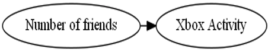

Could also be the reverse—
That activity influences friends

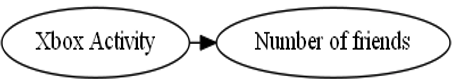

Could also be that a separate effect—
interest in gaming
—effects both

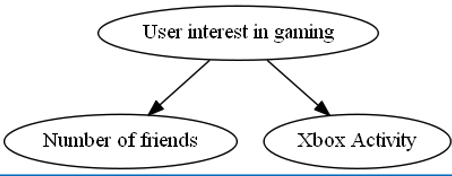

### Google ads

If user searches `Amazon toys`,
and clicks on first ad,
was the ad really responsible for getting them to the Amazon page?

**Counter factual question:** (aka _what-if_)
What if the ad was not there?
Would user still end up on Amazon?

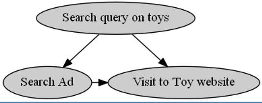

### Toys R Us ads

This is an issue on display ads as well,
which are not shown to user based on intent (search query).

Toys R Us creates a new ad.
Deploys it during December.
Gets a huge increase in click on their ads.
People always buy more during December anyways.

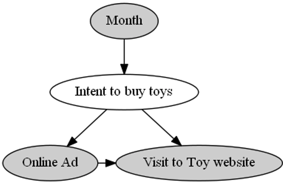

Ignoring hidden causes can not only cause a misdiagnosis of the magnitude of the effect.
But can even hide the direction of it.
Maybe the Toys R Us ads were _worse_ than before.

### Example: algorithms and CTR: Simpson's paradox

Have two algorithms—
`A` and `B`.

| `A`           | `B`             |
| ------------- | --------------- |
| 50/1,000 (5%) | 54/1,000 (5.4%) |

At first glance,
seems `B` is better.

But when you slice it by user type:

| user type     | `A`               | `B`                 |
| ------------- | ----------------- | ------------------- |
| Low-activity  | 10/400 (2.5%)     | 4/200 (2%)          |
| High-activity | 40/600 (6.6%)     | 50/800 (6.2%)       |
| **Total**     | **50/1,000 (5%)** | **54/1,000 (5.4%)** |

Each category performs worse.
This is **Simpson's paradox**.

Both groups were not evenly split up.
So high activity users accounted for the increased activity
since they were more present in the `B` group.
_`A` is better than `B`._

Can be other factors in play—
like time of day.

### Reddit comments

For each set of users per year
average comment length decreases over time.

When you look at by user,
comment length increases over time

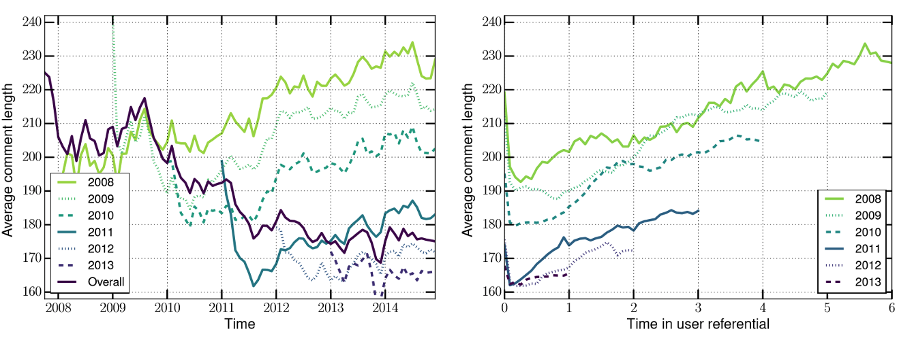

So it's not that comment lengths are decreasing,
but that new users post less.

## Causal inference basics

`X` causes `Y` iff changing `X` changes `Y`
if everything else is held constant.

Basic construct of causal inference is the `what if` questions (counterfactual).
What would happen if I had changed `X`?
What would have been the CTR if we _had not_ changed to a new algorithm?

If we have an old algorithm and a new one.
We want to look at a user's response to the old algorithm in the past (`t - 1`).
Then clone that user and look at their response to the new algorithm in the present (`t`).

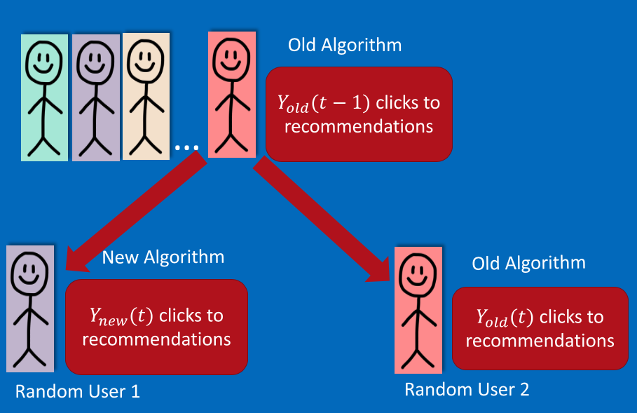

Causal inference is finding ways to realistically create those alternate realities.

### Methods for answering causal questions

This list goes in order of decreasing validity (more robust, trustworthy),
but increasing easy of use.

1. Randomization

   - A/B test
   - Multi-armed bandit

2. Natural experiments

   - Regression discontinuity
   - Instrumental variable

3. Conditioning
   - Stratification
   - Matching
   - Propensity score

### Randomization

#### A/B tests

Assume different groups of randomly selected users are close enough.

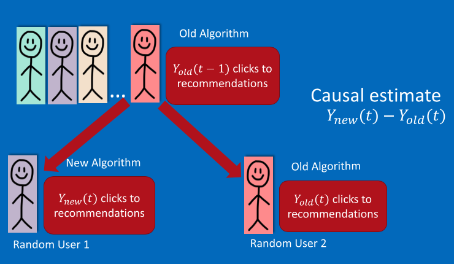

A random selection of old users get the new algorithm,
another random selection get the old algorithm.

To measure the effectiveness,
simply take the difference of `Y` (clicks to recommendation)

##### A/B test cons

This can be costly.
New algorithm can be bad,
don't want to expose it to users.
Can be inefficient to test multiple algorithms.

#### Multi-arm bandit

Two goals:

1. Show the best known algorithm to most users.
2. Keep randomizing to update knowledge about competing algorithms


A small selection of users get a random algorithm.

ɛ-greedy algorithm:

Repeat:

- **Explore** With low probability ɛ, choose an output item randomly.
- **Exploit** Otherwise, show the current-best algorithm.

##### Example: deciding what news articles to show on homepage

Yahoo! News randomizes articles shown on home page,
and shows best performing to most users.

Can use context of visit—
user, time, device, etc
—to show best algorithm depending on user group

##### Multi-arm bandit cons

Can be expensive.
Need a set of alternate algorithms and to test on each one.
Can be hard to identify good alternate algorithms.

## Natural experiments

Not _really_ an experiment.
Exploit naturally occurring close-to-random variation in data.
Since data is not randomized,
need assumptions about data-generating process.

### Example: Effect of store recommendations using natural experiments

Want to estimate causal effect of showing _any_ algorithm recommendation.
Used to benchmark how much revenue a recommendation system bring.

Let's say user gets three recommendations for app
from top three scores.
Get fourth highest score.
So app three and four are really similar.
Can compare their performance by user.

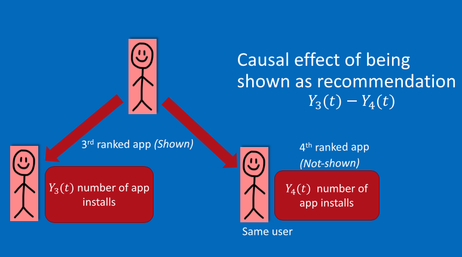

Assumption here is that closely ranked apps are equally relevant.

This is **regression discontinuity**

### Instrumental variables

Can look at as-if random variations due to external events.
Like featuring on Today show leads to a sudden spike in app installs.
External shocks can be used to determine causal effects,
such as effect of showing recommendation.

#### Example: Effects of store recommendations using instrumental variables

How many new visits are caused by the recommender system?
This is a continuation of the previous example.
Should always do multiple methods to see if they agree in conclusion.

`App1` host the recommendation.
`App2` is the recommended app (I think!).

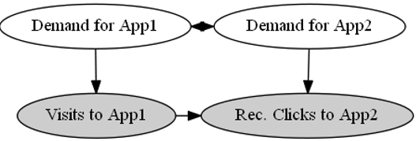

Demand for `App1` is correlated with `App2`.
`App2` naturally gets visits independent of `App1`.

Traffic on normal days to `App1`.

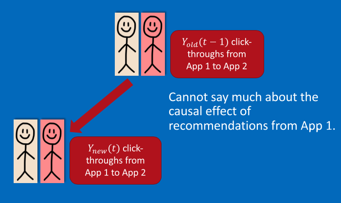

Now we have some spike in visits to `App1`.
Let's say it was featured on Desus & Mero.

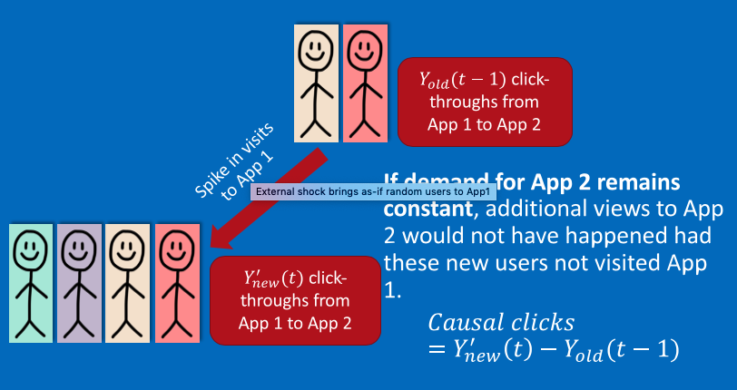

If demand for `App2` remains constant,
additional views would not have happened had these new users not visited App1.

To compute causal click through rate of visits to `App1` on visits to `App2`

Compare observed effect of external event separately on visits to `App1`
and on recommendation clicks to `App2`.

```txt
                              Δ(Rec. Click−throughs from App1 to App2)
causal click through rate = ————————————————————————————————————————————
                                        Δ(Visits to App1)
```

### Cons of natural experiments

They are hard to find!
Weather is a good source of natural experiments.

## Using only observational data

No controlled randomization.
No natural experiment.

Ideal random experiment tests algorithm on two random groups


When using observational data,
can match with similar users.

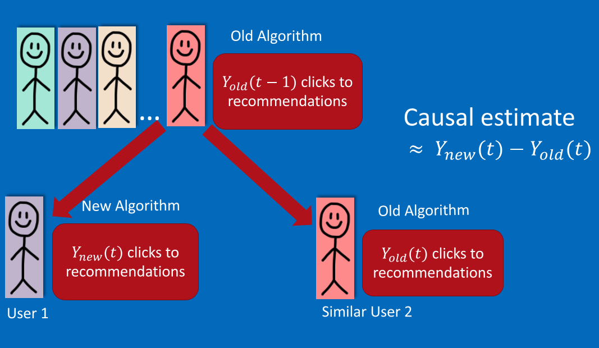

Obvious caveat is that you need a good notion of "similarity."

### Stratification

#### Example: effects of algorithm using stratification

**Does `Algorithm B` increase CTR for recommendations on Store,
compared to `Algorithm A`?**

1. Make assumptions about how the data as generated.
2. Create a graphical model representing those assumptions.

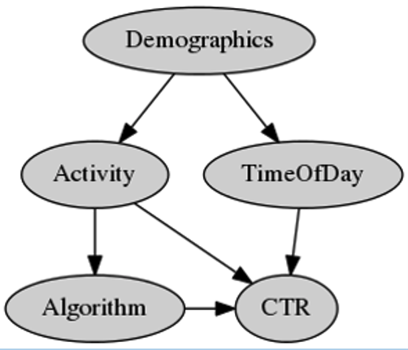

- Activity level of users affects which algorithm they are shown
  and their overall `CTR`.

- `CTR` is different at different times of day.

- Unobserved Demographics of a user determine when they visit the Store,
  which also affects their `Activity` level,
  and in turn the algorithms they are shown.

This influences what kind of conditioning we should do.
This makes sure that when we compare users,
they _actually_ are similar.

Compare effect of algorithm on similar users:

1. Stratify log data based on `Activity` levels
2. Compare `CTR` of different `Algorithm` within these starta

If you just care about the causal effects of the different `Algorithm` values,
might just want to condition on `Activity`.
This seems counterintuitive,
as `TimeOfDay` is also influences `CTR`.

Even though `TimeofDay` influences `CTR`,
any `Alogrithm` is equally likely to be shown at any `TimeOfDay`.

##### Backdoor paths

Use graphical models to identify the correct values to condition on.

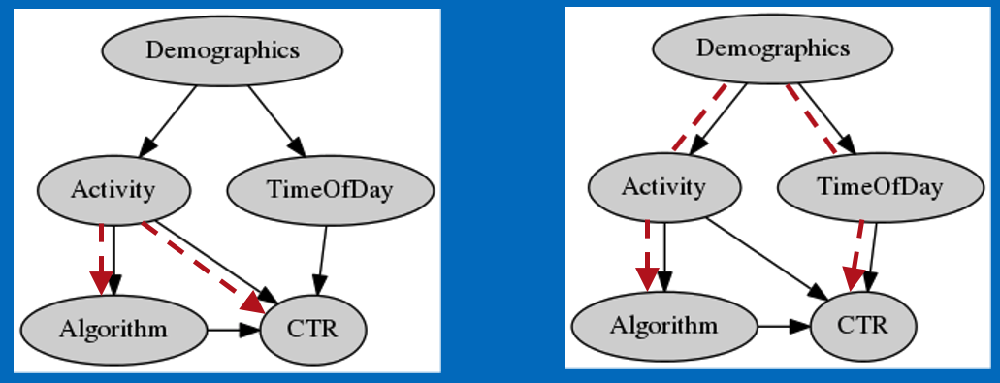

Look for all undirected paths that point to _both_ `Algorithm` and `CTR` in a single path.
Condition on the least amount of variables that could cancel all of these paths.
In this case, both `Activity` and `Demographics` have **backdoor paths**.
If we condition on just `Activity`, it covers all paths.

#### Stratification algorithm

1. Make graphical model of how data is generated
2. Use **backdoor criterion** to choose variables to condition on
3. Stratify data using the variables identified
4. Evaluate the difference in outcome using these strata
5. (Optional) Aggregate over all data

#### Cons of stratification

If data is highly dimensional,
stratification creates tiny strata.

Instead of conditioning on all relevant attributes,
can condition on _likelihood_ of being assigned an algorithm.

### Propensity score matching

This is stratification.

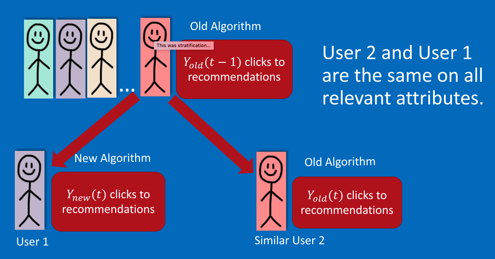

Instead,
match users on their likelihood (propensity) to be shown an algorithm

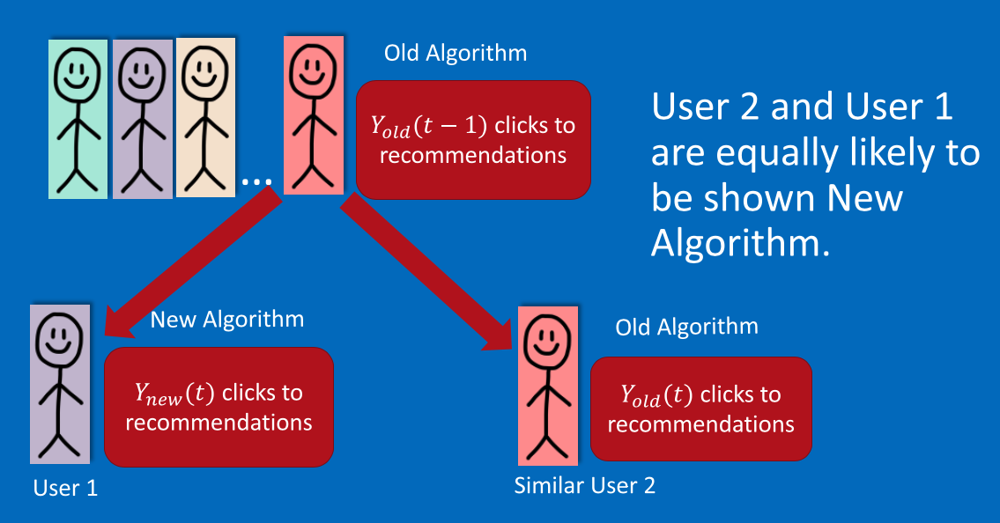

We don't care if users are similar.
We only care about in terms of algorithm shown to them if they are similar or not.

#### Example: effect of algorithm using propensity

Again have multiple algorithms than can be applied to users.
Want to know how this effects click through rate.
Use backdoor criterion.
Condition only on `Activity`.

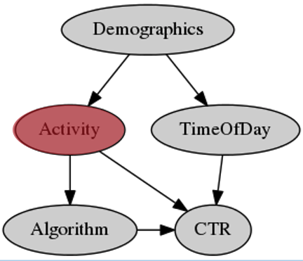

Model likelihood to be shown new algorithm using observed ALgorithm pairs.

```txt
Activity = (a1, a2, a3, a4)
Propensity(User) = Logistic(a1, a2, a3, a4)
```

Logistic regression typically used.
But you can use any algorithm really (trees, SVM).

#### Propensity score matching algorithm

1. Assume graphical model that explains how data is generated.
2. Choose variables to condition on using backdoor criterion
3. Compute propensity score for each user based on conditioned variables.
4. Match pairs of individuals with similar scores,
   where one saw old algorithm,
   one saw new algorithm.
5. Compare outcome variable with each sum matched pair and aggregate.

#### Example: causal effect of a social feed

Friends on social network may Like similar items.
This may be due to influence,
or due to homophily
(similar friends, similar taste)

Given only log data,
how can we determine if social influence due to the newsfeed
compared to homophily effects?

Often each user is very similar to friends.
Friends have similar feeds.

Solution is to create a group of user that are as similar to user as each of their friends,
but are not their friends.
Can compare users to other others who are similar by propensity based on past Likes,
but who are not friends.
Can compare difference in activity to friend
to difference in activity to non-friend.
The degree to which the actual friends are more similar in activity to the non-friends
gives an estimation of the effect of the feed.

#### Cons of propensity matching

Causal effect only if assumed graphical model is correct.

There might be unknown and unobserved causes that might affect Algorithm's CTR.
Early adopters, more tech-savvy, etc.
There might be known unobserved user features.
With only observational data, we can obtain strong hints to causality.

## Takeaways

1. When possible, use randomization.
2. If not,
   use natural experiment.
   Better to consider multiple sources.
3. If not,
   use conditioning methods.
   Use them as strong hints for causality.
